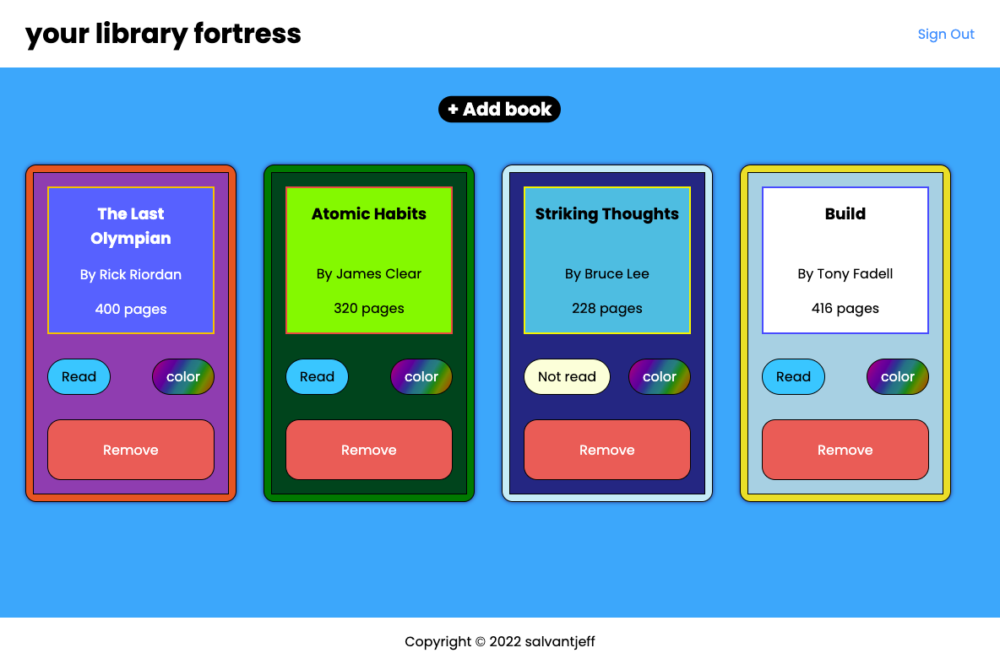

# library
## [Live Demo](https://library-app-2919e.web.app)

## Introduction
Purpose of this project was to create a small Library app. 
The app would allow users to create a catalog of any book of 
their choice by completing a popup form. User authentication was later implemented with firebase.

### Languages and Tools used:

